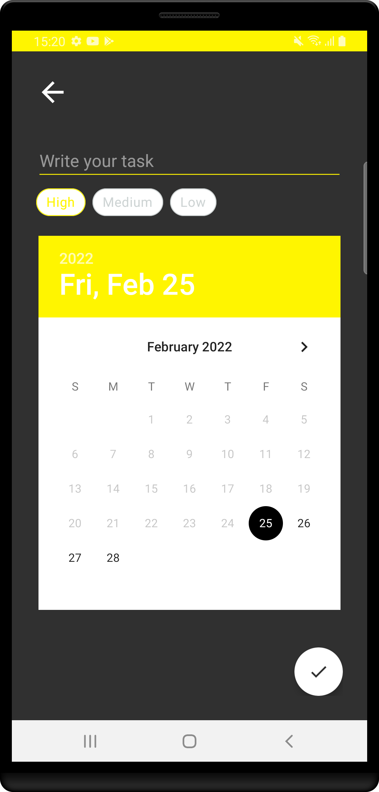

# PERSO-Android-todo-app
The first part of this project was done in a [Android Bootcamp from Udemy](https://www.udemy.com/share/101WBM3@v8dLoK7gdd_BM8MPj1_SZwwpD3vbRcP_MMpsEN5K0Ig_fucV1Y6IUyW5FCANamHB/)
## What has been done ?
* Tasks are save in Room Databse
* User can see an input field where he can type in a to-do item
* By pressing enter (or a button), the User can submit the to-do item and can see that being added to a list of to-do’s
* User can mark a to-do as completed
* User can remove a to-do item by pressing on a button (or on the to-do item itself)
## The next steps ?
* Adding a sort option on the todo list
* Adding subtask
## Bonus features
* User can edit a to-do
* User can see a list with all the completed to-do’s
* User can see a list with all the active to-do’s
* User can see the date when he created the to-do
* When closing the browser window the to-do’s will be stored and when the User returns, the data will be retrieved
## Useful links and resources
* [localStorage](https://developer.mozilla.org/en-US/docs/Web/API/Window/localStorage)
## Current UI

